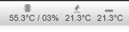

# UI Customizer

A [OctoPrint](https://github.com/foosel/OctoPrint) plugin that allows you to customize the look and feel of the user interface.
It also features a lot of other fixes and improvements:
* Change width of the columns
* Move "widgets" around in columns
* Turn on/off responsive layout
* Improved settings window
* Fixed header/topbar
* Fixed footer/bottombar
* Fluid/full width layout
* Hide temperature background graphics
* Zoomed/Floating webcam option
* Extra Webcam "widget"
* [Compact Navbar temp](https://plugins.octoprint.org/plugins/navbartemp/) icons
* Hide widget
* Realtime preview of changes
* Center top bar icons

## Setup

Install via the bundled [Plugin Manager](https://github.com/foosel/OctoPrint/wiki/Plugin:-Plugin-Manager)
or manually using this URL:

    https://github.com/LazeMSS/OctoPrint-UICustomizer/archive/main.zip

## Configuration
The configuration is split into 4 tabs:

### General

* Preview - switching this on will minimize the settingsdialog and preview any changes made to UI Customizer settings directly in the UI
* Fixed header/topbar - should the top menubar stay fixed when scrolling or not
* Fluid/full width layout - should the entire screen width be used or not
* Fixed footer/bottombar - should the bottom bar stay fixed when scrolling or not
* Hide temp. graph background - Hide temperature background graphics
* Compact ["Navbar temperature plugin"](https://plugins.octoprint.org/plugins/navbartemp/) - will add icons and shrink the temperature display on this awesome plugin
* Improve mobile/responsive - enable the improved responsive modes including settings for mobile screens etc.
* Center topbar icons - will horizontal center the extra plugins/top icons in the topbar
* Zoom/float webcam icon - will add an zoom icon to the webcam live feed that will popup out the webcam video feed into a floating resizeable overlay
* Hide main camera - should the main camera be hidden - only acive if the webcam widget is enabled
* Compact menu - should the "dropdown" menu be a single compact menu

### Layout

The layout of the screen can be made into 1,2 or 3 columns and the size of the columns can be adjusted. The total width of the columns added together must not be greater than 12. Each column can contain zero or more widgets, widgets are the diffent "containers" for all the user interface, ie. the webcam, files etc.
If you want a two or one column layout then just drag the "widgets" all the widgets into the left hand side columns.
Each widget can be moved by draging. The widgets can also be hidden by clicking the eye on the right hand side of the widget.

### Main tabs

The main/center tabs can be changed using this settings panel.
* The first field is for entering a custom name for the tab, if left blank it will use default.
* The "eye" icon can show or hide the entire tab and its content - click to toggle show/hide.
* The next icon is the icon shown in the tab - if no icon is selected then a blue magnifying glass is shown. Click the icon to get a search dialog up for searching icons. Click the icon you want or click the trashcan icon to leave it blank.
* The Left/Right dropdown is used for setting the alignment of the icon on the tab.
* The up/down arrow is used to change the order of the tabs

### Advanced
* Disable terminal when hidden - Disables the terminal update when the terminal tab is in the background - gives a small perfomance boost.

## Screenshots/Video
[YouTube](https://youtu.be/BTiI6i1Rc5c)
### Responsive layouts

### Overview with webcam widget

### Floating webcam

### Compact Navbar temp

