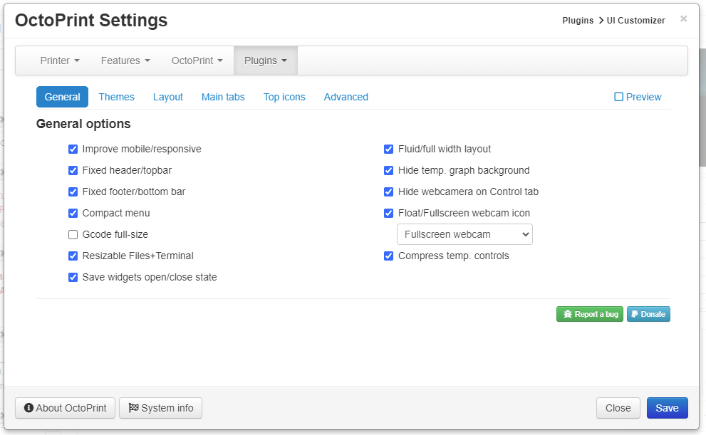
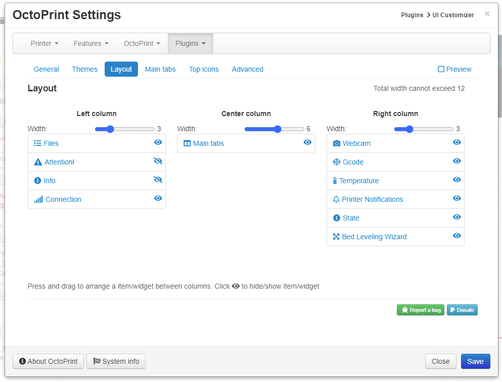
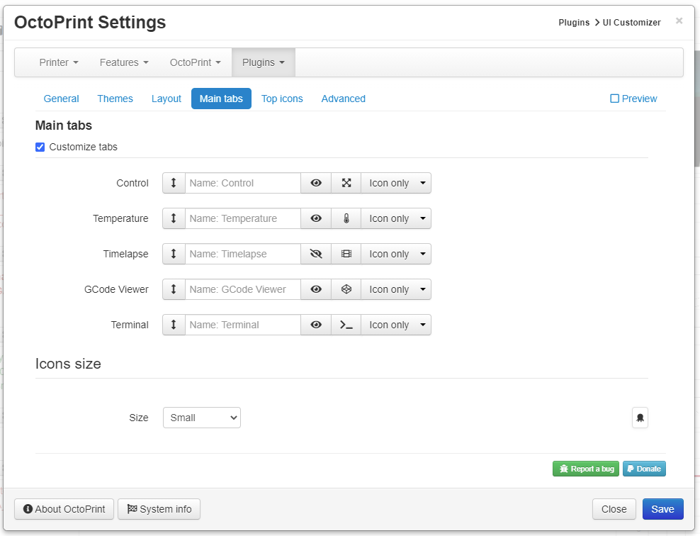
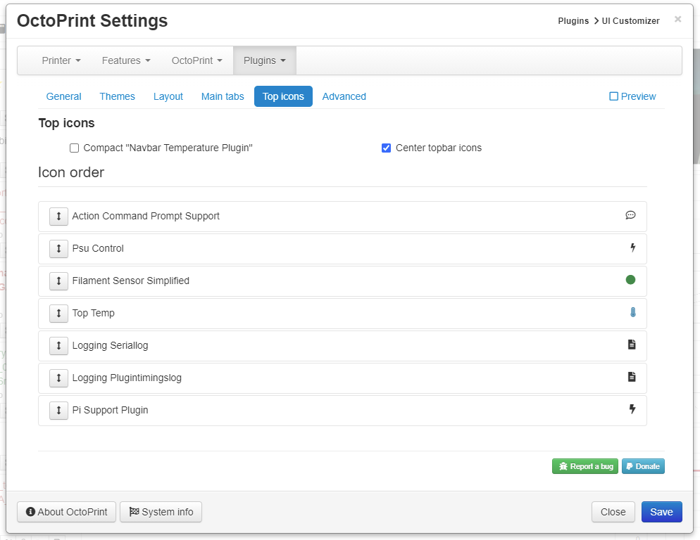

# UI Customizer

A [OctoPrint](https://github.com/foosel/OctoPrint) plugin that allows you to customize the look and feel of the user interface.
It also features a lot of other fixes and improvements:
* Themes/skins - choose between 6+ themes
* Customize tabs: Change icon, labels, order, show/hide
* Change width of the columns
* Sort the order to icons in the menu bar (top icons)
* Move "widgets" around in columns
* Turn on/off responsive layout
* Improved settings window
* Fixed header/topbar
* Fixed footer/bottombar
* Fluid/full width layout
* Hide temperature background graphics
* Zoomed/Floating or Fullscreen webcam option
* Extra Webcam "widget"
* Extra Gcode viewer "widget"
* Extra Temperature "widget"
* [Compact Navbar temp](https://plugins.octoprint.org/plugins/navbartemp/) icons
* Hide widgets
* Hide main camera on Control tab
* Center top bar icons
* Realtime preview of changes

Table of Contents
=================
  * [Setup](#setup)
  * [Configuration](#configuration)
     * [General](#general)
     * [Themes](#themes)
     * [Layout](#layout)
     * [Main tabs](#main-tabs)
     * [Top icons](#top-icons)
     * [Advanced](#advanced)
  * [Donation/support](#donationsupport)
  * [Credits](#credits)
  * [More screenshots/Video](#more-screenshotsvideo)
     * [Webcam and gcode widget](#webcam-and-gcode-widget)
     * [Floating webcam](#floating-webcam)

## Setup

Install via the bundled [Plugin Manager](https://github.com/foosel/OctoPrint/wiki/Plugin:-Plugin-Manager)
or manually using this URL:

    https://github.com/LazeMSS/OctoPrint-UICustomizer/archive/main.zip

## Configuration
The configuration is split into 6 tabs - all have an preview option in the top right menu

### General
  
* Improve mobile/responsive - enable the improved responsive modes including settings for mobile screens etc.
* Fluid/full width layout - should the entire screen width be used or not
* Fixed header/topbar - should the top menubar stay fixed when scrolling or not
* Hide temp. graph background - Hide temperature background graphics
* Fixed footer/bottombar - should the bottom bar stay fixed when scrolling or not
* Hide webcamera on Control tab - should the webcamera on the Control tab be hidden or pop back into when control tab is active
* Compact menu - should the "dropdown" menu be a single compact menu
* Float/Fullscreen webcam  - will add an zoom icon to the webcam that will popup out the webcam video into a floating resizeable overlay or fullscreen
* Gcode full-size - maximize the main gcode viewer to take up as much space as possible
* Resizable Files+Terminal - when turned on the Files and Terminal are resizable
* Compress temp. controls - compress/minimize the temperature controls in the temperature main tab
* Save widgets open/close state - when turned on the open/closed state of all widgets(accordions) are saved locally in the browser and restored on reload etc.

### Themes
Select a theme - notice you can enable preview and see the theme in a realtime preview.
When clicking this tab for the first time you will need to confirm that it's okay to download the different themes from the remote themes site (https://lazemss.github.io/OctoPrint-UICustomizerThemes/) this is done in so we can update themes without updating the plugin.
  

### Layout
  
The layout of the screen can be made into 1,2 or 3 columns and the size of the columns can be adjusted. The total width of the columns added together must not be greater than 12. Each column can contain zero or more widgets, widgets are the diffent "containers" for all the user interface, ie. the webcam, files etc.
If you want a two or one column layout then just drag the "widgets" all the widgets into the left hand side columns.
Each widget can be moved by draging. The widgets can also be hidden by clicking the eye on the right hand side of the widget.
Notice there is 3 extras widgets included with UI Customizer:
- Webcam widget which allows you to have a webcam outside the main Control tab
- Gcode widget which allows you to have a gcode viewer outside the main Gcode viewer tab
- Temperature widget which allows you to have the temperature outside the main Temperature tab

### Main tabs
  
The main/center tabs can be changed using this settings panel.
* The up and down arrow is used to change the order of the tabs
* The first field is for entering a custom name for the tab, if left blank it will use default.
* The "eye" icon can show or hide the entire tab and its content - click to toggle show/hide.
* The next icon is used to the change the icon and color of icon, shown in the tab. If no icon is selected then a blue magnifying glass is shown. Click the icon to get a dialog up for searching icons and picking a color. Enter a searchword and the icon you want and color using the "eye-dropper". Click the trashcan icon if you dont want to select an icon.
* The last dropdown is to change what is shown on the tab: Icon + Text (Icon on the left - text on the right), Text + Icon, Icon only, Text only - notice its not possible to make "empty" tabs ie. selecting "Icon only" and then no icon is selected

Icon size allows you to pick the size of the icons on the tab icons.

### Top icons
  
This allows you to change the look & feel of the top icons in top menu/navbar
* Compact ["Navbar temperature plugin"](https://plugins.octoprint.org/plugins/navbartemp/) - will add icons and shrink the temperature display on this awesome plugin
* Center topbar icons - will horizontal center the extra plugins/top icons in the topbar
* Icon order - change the order in which the icons are displayed in the top menu bar - notice some icons can be hidden. Turn on "Preview" to see them

### Advanced

  
* Disable terminal when hidden - Disables the terminal update when the terminal tab is in the background - gives a small perfomance boost.
* Custom CSS - Enter any custom CSS styling you want to have applied
* Export settings - Will export all the UI Customizer settings into a file that can be downloaded
* Import settings - Will import an exported settings file - this can be usefull if you have settings you want to apply to several OctoPrint installations

## Donation/support
If you like my work feel free to support me using paypal: https://www.paypal.com/donate/?business=2STH3SD3KXGNQ&item_name=UI+Customizer

## Credits
- Many of the themes includes is derived from https://bootswatch.com/2/ - under the APACHE LICENSE, VERSION 2.0
- The red night theme is created by the very talented @Poeschl

## More screenshots
### Webcam and gcode widget

### Floating webcam

